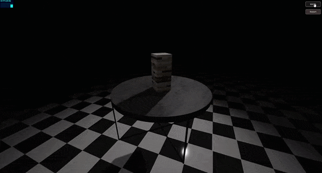

# Jenga 🧱🤏🏼

> Jenga — a board game that originated in the early 70s 📌

### See the <a href='https://dnt-knw.github.io/Jenga' target='_blank' title='Click to open the project'>Demo</a> 👁

## Description 📖

- 📜 There are two engines to choose from
- 📜 The tower consists of 54 blocks
- 📜 You can interact with the blocks, and they, in turn, with each other

## Usage ⌨️

- Hover the cursor 🖱 over the block 🧱, hold down the left mouse button 🖱 and drag this block 🧱 on PC 🖥 / Laptop 💻
- Point your finger 👆 at the block 🧱 and drag this block 🧱 on mobile 📱
- Use the "Restart" button 🔄 to build 🛠️ a new tower 🗼
- Use the "Boom" button 💣 to explode 💥 the tower 🗼
- Enjoy 😍
